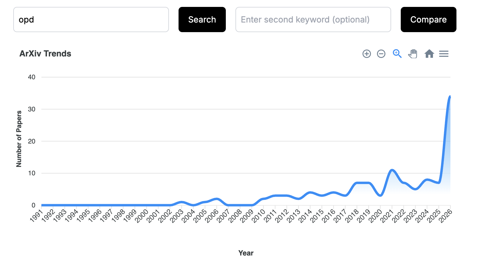

# On Policy Distillation Landscape

**On Policy Distillation Landscape** is an evidence-backed research map of **On-Policy Distillation (OPD)** for LLMs and frontier extensions into VLMs, MLLMs, VLA systems, and agents.

This repo starts from [A Survey of On-Policy Distillation for Large Language Models](https://arxiv.org/abs/2604.00626), then audits methods, industrial reports, and adjacent work against one strict OPD definition. It is not a flat paper list: it is a classification system, a set of validated evidence tables, and a reader path through a fast-moving research area.

Last checked: 2026-05-14

## Catalog

Start here if you are showing the repo to someone else.

| Need | Read |
|---|---|
| Understand the OPD boundary | [Unified Definition](#unified-definition), [taxonomies/strict-opd-definition.md](taxonomies/strict-opd-definition.md) |
| Find the current label for a method | [tables/opd_papers.md](tables/opd_papers.md), [tables/vlm_opd_papers.md](tables/vlm_opd_papers.md), [tables/adjacent_work.md](tables/adjacent_work.md) |
| Read by method family | [Landscape by Family](#landscape-by-family), then the linked pages in [papers/](papers/) |
| Compare OPD with SFT, DPO, RLHF, RLVR, or offline KD | [notes/](notes/) |
| Understand implementation and evaluation | [implementations/](implementations/), [tables/frameworks.md](tables/frameworks.md), [tables/benchmarks.md](tables/benchmarks.md) |
| Audit how a label was decided | [assets/research/](assets/research/) |
| Add or update a paper | [CONTRIBUTING.md](CONTRIBUTING.md), then run `python3 scripts/validate_entries.py` |

## What This Repo Provides

- **A strict OPD test:** every method is checked for student rollouts, same-rollout teacher-style supervision, and objective consumption.
- **Current labels:** methods are classified as `strict_opd`, `borderline_strict`, `partial_opd`, `adjacent`, `not_opd`, or `unclear`.
- **False-positive control:** reward-only RLVR, offline KD, SFT on teacher traces, static DPO, and synthetic trajectory tuning are kept out of strict OPD.
- **Frontier coverage:** LLM, VLM/MLLM, video, speech, VLA, GUI, agentic, industrial, and systems methods are tracked under the same boundary rule.
- **Implementation awareness:** framework support, rollout freshness, teacher access, confidence, code/weights status, benchmarks, and compute notes are recorded.
- **Research provenance:** raw audits and synthesis memos are archived separately from the clean reader-facing landscape.

## Quick Reading Paths

**10-minute overview**

1. Read [Unified Definition](#unified-definition).
2. Read [Current Landscape Snapshot](#current-landscape-snapshot).
3. Open [tables/opd_papers.md](tables/opd_papers.md) and scan `opd_strictness`, `rollout_freshness`, `strictness_evidence`, and `confidence`.

**Research deep dive**

1. Read [taxonomies/strict-opd-definition.md](taxonomies/strict-opd-definition.md).
2. Pick a family from [Landscape by Family](#landscape-by-family).
3. Check the corresponding table row and adjacent-work row before trusting a label.

**Implementation or evaluation**

1. Read [implementations/frameworks.md](implementations/frameworks.md).
2. Read [implementations/evaluation.md](implementations/evaluation.md).
3. Pair task metrics with rollout, recovery, calibration, distributional-fidelity, or teacher-uncertainty diagnostics.

## Why OPD Exists

Conventional distillation is mostly **off-policy**: a student is trained on static teacher-generated data or teacher-forced prefixes. At inference time, the student conditions on its own previous tokens, mistakes, tool calls, or actions. This creates a train-test mismatch: the student never receives feedback on many states it actually visits.

OPD addresses that exposure-bias problem by letting the student generate trajectories from its current policy, then obtaining feedback on those student-visited states.

<p align="center">
  
</p>

Source: arXiv Trends, captured 2026-05-11.

## Unified Definition

A method is **Strict OPD** only if all three conditions are supported by source evidence:

1. **C1: Student rollout** - the current student or policy generates the trajectories, completions, rationales, tool calls, actions, or intermediate states used for training.
2. **C2: Teacher-style supervision** - a teacher, expert, discriminator, privileged-context model, reference model, previous checkpoint, or equivalent source supervises those exact student-generated states.
3. **C3: Objective consumption** - the training objective directly consumes that supervision signal.

If the method has online rollouts but only reward or verifier feedback, it is adjacent unless the feedback is explicitly used as distillation-style supervision. If it has distillation but no student-generated training states, it is offline KD, not OPD.

## Classification Flow

Plain Markdown version for previews that do not render Mermaid:

1. Did the current student generate the supervised state?
   - No: `not_opd` or offline KD.
   - Yes: continue.
2. Did a teacher, expert, discriminator, reference model, privileged self, previous checkpoint, or equivalent source supervise that same state?
   - No, only reward or verifier feedback: usually `adjacent`.
   - Yes: continue.
3. Did the loss consume that supervision directly?
   - Yes, token/logit/action/distributional signal: usually `strict_opd`.
   - Yes, but response-level, gated, mixed, or subcomponent-only: `borderline_strict` or `partial_opd`.
   - No or unclear: `partial_opd`, `adjacent`, or `unclear`.

## Current Landscape Snapshot

The tables are the canonical source of current labels. This summary is only a map.

**Strict core**

Source-verified methods with current student rollouts and teacher-style supervision on those rollouts. Examples include GKD, MiniLLM, DistillSpec draft training, Entropy-Aware OPD, G-OPD, REOPOLD, Veto, Fast OPD, OPSD, CRISP/OPSDC, SDPO, OPCD, Uni-OPD, MAD-OPD, VLA-OPD, Video-OPD, X-OPD, MiMo-V2-Flash MOPD, and Nemotron-Cascade2 MOPD.

**Source-weak stage-scoped strict**

Strict only for a disclosed stage, not for the full pipeline. Qwen3's OPD phase belongs here because the public mechanics are terse, so the row remains medium-confidence/source-weak.

**Borderline strict**

Same-rollout supervision exists, but the method is hybrid, gated, modality-specific, response-level, or component-only. Examples include KDRL, SCOPE, Gemma2 post-training, TCOD, Skill-SD, OpenClaw-RL OPD component, KEPO, D-OPSD, and Flow-OPD.

**Partial OPD**

Some OPD conditions hold, but rollout freshness, teacher signal, or objective consumption is weakened. Examples include DistiLLM, DistiLLM-2, GAD, OVD, SODA, ORPO-Distill, OEL, PACED, Lightning OPD, StableOPD, PAD, ADPA, and daDPO.

**Adjacent or not OPD**

Useful related work, but missing current student rollout, same-rollout teacher supervision, or distillation-style objective consumption. Examples include PRISM, OEC, VLM-R1, Perception-R1, GTR-Turbo, RLKD, Lion, LLaVA-KD, LLAVADI, DeepSeek-R1 distilled checkpoints, and Visual Program Distillation.

## Landscape by Family

Each family page explains the boundary and links back to canonical table rows.

**Foundations and theory**

Strict seeds plus the survey backbone: OPD survey, GKD pure on-policy variants, MiniLLM, and exposure-bias motivation.  
Read: [papers/foundations-and-theory.md](papers/foundations-and-theory.md)

**White-box distributional OPD**

Dense teacher logits, probabilities, or log-probs supervise student-generated states. This is the strongest strict OPD cluster.  
Read: [papers/white-box-distributional-opd.md](papers/white-box-distributional-opd.md)

**Black-box/API OPD**

Closed teacher APIs, verbal feedback, preferences, discriminators, and response-level feedback. No source-verified strict seed is currently in this bucket.  
Read: [papers/black-box-and-api-opd.md](papers/black-box-and-api-opd.md)

**Teacher-free and self-play OPD**

Previous checkpoints, privileged self-views, context-conditioned self-teachers, and self-play methods. Strict rows need a concrete teacher substitute on the student's rollout.  
Read: [papers/self-play-and-teacher-free-opd.md](papers/self-play-and-teacher-free-opd.md)

**Reasoning and OPD+RL hybrids**

Math, code, long-CoT, and RL-style objectives. Dense teacher guidance can be strict; scalar reward compression is adjacent.  
Read: [papers/reasoning-and-opd-rl-hybrids.md](papers/reasoning-and-opd-rl-hybrids.md)

**Industrial and scaling systems**

Official reports, training stages, framework support, speculative decoding, multi-teacher routing, and teacher-serving cost.  
Read: [papers/industrial-and-scaling.md](papers/industrial-and-scaling.md), [tables/industrial_reports.md](tables/industrial_reports.md)

**Agentic and interactive OPD**

Tool calls, GUI, browser, SWE, VLA, robotics, and multi-turn environments. Strict rows require teacher-style supervision on visited states or action tokens.  
Read: [papers/agentic-and-interactive-opd.md](papers/agentic-and-interactive-opd.md)

**Multimodal frontiers**

VLM, MLLM, video, speech, VLA, GUI, diffusion, and flow. The strict core is small; many popular frontier methods are reward-only or offline.  
Read: [papers/multimodal-frontiers.md](papers/multimodal-frontiers.md), [tables/vlm_opd_papers.md](tables/vlm_opd_papers.md)

**Adjacent but not OPD**

False positives and boundary methods: RLVR, DPO, offline KD, synthetic traces, SFT on teacher completions, and reward-shaped PPO.  
Read: [papers/adjacent-but-not-opd.md](papers/adjacent-but-not-opd.md), [tables/adjacent_work.md](tables/adjacent_work.md)

## Taxonomy

The repo classifies each method along these axes:

| Axis | Question |
|---|---|
| Feedback signal | Is the signal logit-based, outcome-based, preference-based, self-play, hybrid, adversarial, action-level, or offline KD? |
| Teacher access | Is the teacher white-box, black-box, teacher-free, multi-teacher, expert policy, or absent? |
| Loss granularity | Is supervision token-level, sequence-level, action-level, hybrid, or outcome-only? |
| Rollout source | Was the supervised state generated by the current student, a mixed policy, an older policy, the teacher, or a static dataset? |
| Rollout freshness | Is the rollout current-policy, per-iteration, per-epoch, stale replay, precomputed, static, mixed, or unclear? |
| Teacher kind | Is the source a larger LLM, multimodal teacher, expert policy, discriminator, reference model, privileged self, previous checkpoint, verifier, or none? |
| Modality | Is the method text-only, multimodal, video, speech, VLA, GUI, agentic, diffusion, or flow? |

See [taxonomies/](taxonomies/) for the full rules.

## Repository Map

| Path | Purpose |
|---|---|
| [tables/](tables/) | Canonical machine-checkable Markdown tables for papers, VLM papers, frameworks, benchmarks, industrial reports, and adjacent work. |
| [papers/](papers/) | Narrative method-family pages. |
| [taxonomies/](taxonomies/) | Classification definitions and boundary rules. |
| [implementations/](implementations/) | Framework, codebase, benchmark, reproduction, compute, and evaluation notes. |
| [notes/](notes/) | Short conceptual explainers and comparisons. |
| [reading-paths/](reading-paths/) | Reader paths by background or use case. |
| [assets/research/](assets/research/) | Archived research provenance, synthesis memos, raw agent reports, and historical prompts. |
| [scripts/](scripts/) | Table schema and validation scripts. |

## Canonical Tables

- [OPD papers](tables/opd_papers.md)
- [VLM / MLLM / VLA OPD papers](tables/vlm_opd_papers.md)
- [Frameworks](tables/frameworks.md)
- [Industrial reports](tables/industrial_reports.md)
- [Benchmarks](tables/benchmarks.md)
- [Adjacent work](tables/adjacent_work.md)

Run:

```bash
python3 scripts/validate_entries.py
```

The validator checks table headers, enum values, URLs, dates, strictness rules, and evidence fields such as `feedback_route`, `teacher_access_regime`, `rollout_freshness`, `teacher_kind`, `strictness_evidence`, `conflict_status`, `divergence_or_objective`, and `on_policy_strength`.

## Evaluation Rule

Benchmark accuracy alone is not OPD evidence. A serious OPD evaluation should pair capability metrics with at least one OPD-specific diagnostic:

- rollout drift or recovery from corrupted prefixes;
- calibration or teacher-student uncertainty transfer;
- KL/JSD/distributional fidelity;
- action-token or coordinate fidelity for VLA/GUI settings;
- matched controls against SFT, offline KD, DPO/RLHF, reward-only RLVR, or behavior cloning.

See [implementations/evaluation.md](implementations/evaluation.md) and [tables/benchmarks.md](tables/benchmarks.md).

## Research Provenance

The clean landscape lives in the root README, tables, taxonomies, paper-family pages, implementation notes, and reading paths. Audit memos, prompts, and controller handoff files are archived under [assets/research](assets/research/), where the archive README explains historical filename prefixes.

## Contributing

This repository is taxonomy-first and evidence-first. Do not add papers as plain links. Every contribution must include source evidence, strictness, feedback route, teacher access regime, loss granularity, rollout source, rollout freshness, teacher kind, strictness evidence, confidence, and a classification rationale.

See [CONTRIBUTING.md](CONTRIBUTING.md).
